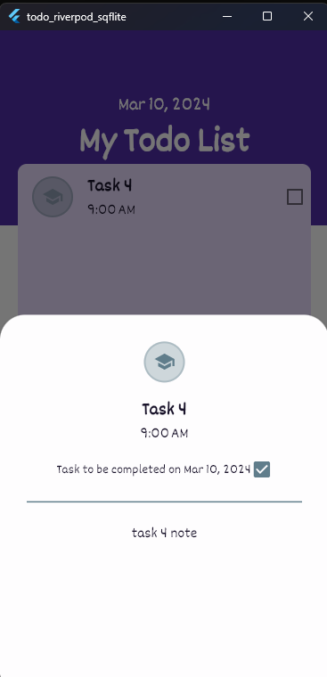

# todo_riverpod_sqflite

A new Flutter project.

# commands:
Flutter Version:  3.19.2

# screen shots:
<table style="padding:10px">
  <tr>
    <td> 
        
    </td>    
    <td>
        
    </td>
    <td>
        
    </td>
  </tr>
  <tr>
    <td> 
        
    </td>    
    <td>
        
    </td>
    <td>
        
    </td>
  </tr>
  <tr>
    <td> 
        
    </td>    
    <td>
        
    </td>
    <td>
        
    </td>
  </tr>
  <tr>
    <td> 
        
    </td>    
    <td>
        
    </td>
    <td>
        
    </td>
  </tr>
  <tr>
    <td> 
        
    </td>    
  </tr>
</table>

# reference:
https://www.youtube.com/watch?v=vfhbCSTxi74
https://github.com/IsaiasCuvula/flutter_riverpod_todo_app

<pre>
Create Project:
    flutter create  -e todo_riverpod_sqflite 
                    --platforms android,windows 
                    --org "com.cjtech"

Run Project:
    flutter run -d windows

Old - New Packages:
    equatable: ^2.0.5
    flex_color_scheme: ^7.2.0 - ^7.3.1
    flutter_riverpod: ^2.3.6 - ^2.4.10
    font_awesome_flutter: ^10.5.0 - ^10.7.0
    gap: ^3.0.1 - ^3.3.0
    go_router: ^10.0.0 - ^13.2.0
    google_fonts: ^5.1.0 - ^6.2.0
    intl: ^0.18.1 - ^0.19.0
    path: ^1.8.3 - ^1.9.0
    sqflite: ^2.3.0 - ^2.3.2

Used Packages:
    equatable: ^2.0.5
    flex_color_scheme: ^7.3.1
    flutter_riverpod: ^2.4.10
    font_awesome_flutter: ^10.7.0
    gap: ^3.0.1
    go_router: ^13.2.0
    google_fonts: ^6.2.0
    intl: ^0.19.0
    path: ^1.9.0
    sqflite: ^2.3.2    
  
=========================================================================
OnBackInvokedCallback:
**********************
C:\WFF\todo_riverpod_sqflite> flutter run
Launching lib\main.dart on sdk gphone64 x86 64 in debug mode...
Running Gradle task 'assembleDebug'...                              9.2s
✓  Built build\app\outputs\flutter-apk\app-debug.apk.
Installing build\app\outputs\flutter-apk\app-debug.apk...        1,165ms
Syncing files to device sdk gphone64 x86 64...                     152ms

Flutter run key commands.
r Hot reload. 🔥🔥🔥
R Hot restart.
h List all available interactive commands.
d Detach (terminate "flutter run" but leave application running).
c Clear the screen
q Quit (terminate the application on the device).

A Dart VM Service on sdk gphone64 x86 64 is available at: http://127.0.0.1:51926/0jO5i21KNDs=/
The Flutter DevTools debugger and profiler on sdk gphone64 x86 64 is available at:
http://127.0.0.1:9101?uri=http://127.0.0.1:51926/0jO5i21KNDs=/
D/EGL_emulation( 4208): app_time_stats: avg=2078.28ms min=41.82ms max=4114.73ms count=2
D/EGL_emulation( 4208): app_time_stats: avg=38.85ms min=2.17ms max=1085.22ms count=33
W/WindowOnBackDispatcher( 4208): OnBackInvokedCallback is not enabled for the application.
W/WindowOnBackDispatcher( 4208): Set 'android:enableOnBackInvokedCallback="true"' in the application manifest.

Performing hot restart...
Restarted application in 1,517ms.
D/EGL_emulation( 4208): app_time_stats: avg=122772.02ms min=117.28ms max=245426.75ms count=2
Application finished.
Terminate batch job (Y/N)? y
C:\WFF\todo_riverpod_sqflite>
--SOLUTION-------------------------------------------------------------
Goto : android>app>src>main>AndroidManifest.xml
Add property: android:enableOnBackInvokedCallback="true" 
in application tag

&lt;manifest xmlns:android="http://schemas.android.com/apk/res/android"&gt;
    &lt;application
        android:label="todo_riverpod_sqflite"
        android:name="${applicationName}"
        android:enableOnBackInvokedCallback="true"
        android:icon="@mipmap/ic_launcher"&gt;
    ...
    &lt;/application&gt;
&lt;/manifest&gt;    

-------------------------------------------------------------------------        
=========================================================================
</pre>